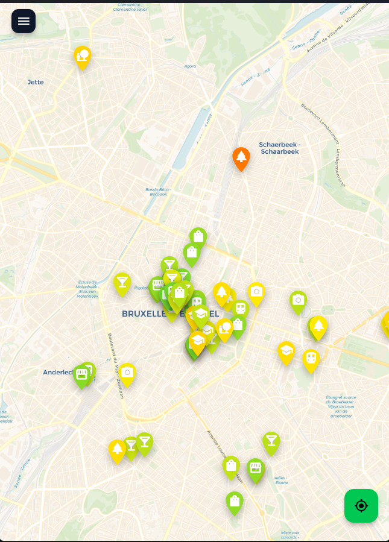
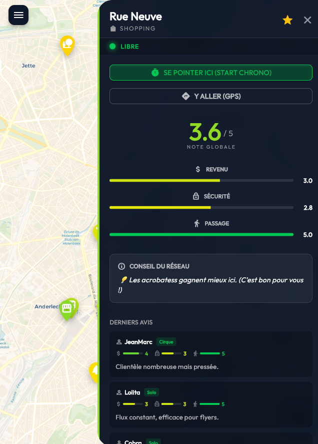
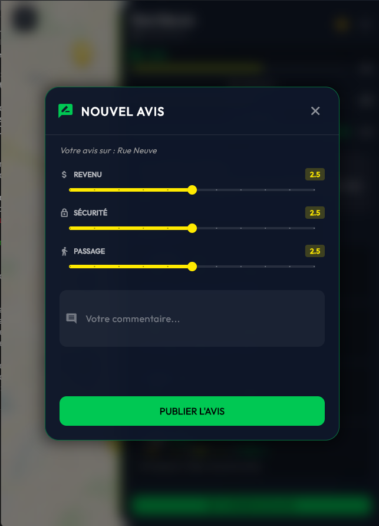
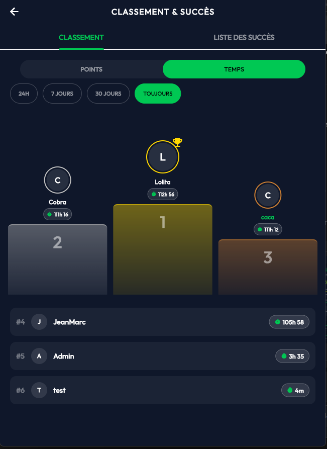
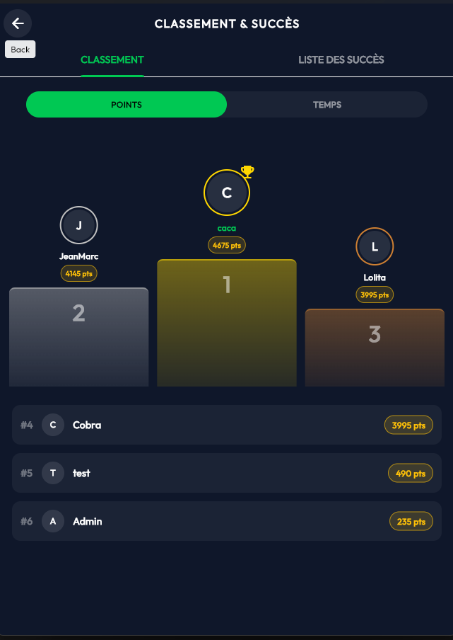
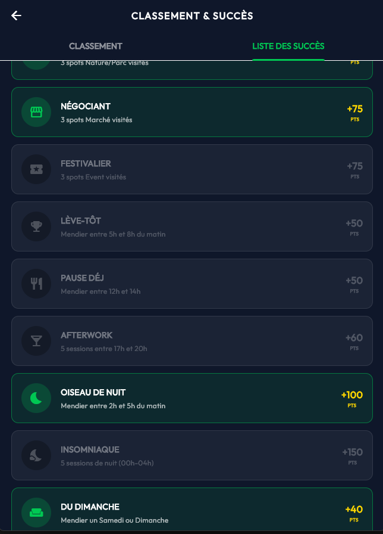
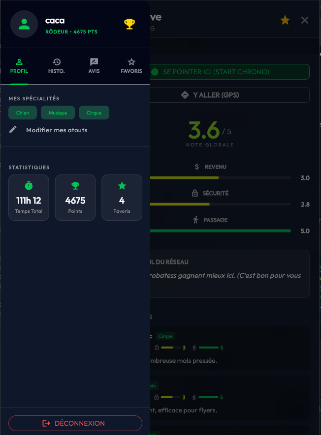

# PoorSpot ⛺💸  
**Odoo Hackathon 2025 Entry**  
**Theme :** *“What Could Possibly Go Wrong?”*  
**Slogan :** *Challenge Accepted.*
**Ranking :** *1er🏆* 

---

## 📖 À propos du projet

**PoorSpot** est la première plateforme d’optimisation de rendement, basée sur les données et la participation communautaire, dédiée au… *secteur informel de la mendicité de rue*.  

Créée en 48h de hackathon sans sommeil, l’application répond à une question essentielle :  
**Pourquoi mendier au hasard quand on peut le faire stratégiquement ?**

L’application permet aux utilisateurs de :

- **Localiser les meilleurs spots** : zones avec le plus haut trafic et les meilleurs “indices de générosité”.
- **Optimiser leurs shifts** : check-in/out pour suivre leurs revenus horaires.
- **Rester en sécurité** : notes communautaires pour éviter les zones à forte présence policière ou architecture hostile.
- **Gamifier la pauvreté** : succès, rang global, progression, etc.

> **Disclaimer :** projet satirique créé pour le Odoo Hackathon 2025 dans le thème *“What Could Possibly Go Wrong?”*.  
> Parodie assumée des dérives de la gig economy.

---

## 📱 Visuals

<p align="center">
  
  
  
  
</p>
<p align="center">
  
  
  
</p>

---

## 🚀 Fonctionnalités

### 🗺️ Smart Mapping (Waze de la rue)
- Visualisation en temps réel des spots.
- Catégorisation par potentiel : **Tourisme**, **Business**, **Nightlife**, **Shopping**, etc.

### ⭐ Notes Communautaires
Évaluations selon 3 KPI essentiels :
1. **Potentiel de revenu**  
2. **Sécurité**  
3. **Trafic piéton**

### ⏱️ Gestion de Session
- **Check-in/Check-out** : permet d’annoncer que le spot est occupé.
- **Timer de shift** : suivi automatique du “temps de travail”.

### 🏆 Gamification & Leaderboard
Plus de 50 succès à débloquer :
- **Early Bird** : shift commencé entre 5h et 8h.  
- **Insomniac** : 5 shifts de nuit.  
- **Risk Taker** : opérer dans une zone à faible sécurité.  
- **Rich Zone** : valider un spot 5/5 en revenu.  

---

## 🛠️ Stack Technique

Développé en pair programming sur une machine en 48h.

### **Frontend : Flutter (Dart)**
- `flutter_map` (OpenStreetMap)
- `geolocator` (GPS)
- `google_fonts` (UI propre)

### **Backend : Python (FastAPI)**
- API REST custom
- Persistence JSON (`db.json`)
- Moteur de logique pour les achievements

---

## 💻 Getting Started

### 📦 Prérequis
- Flutter SDK  
- Python 3.9+

### ⚙️ Installation

#### 1. Cloner le repo
```bash
git clone https://github.com/your-username/poorspot.git
cd poorspot
```

#### 2. Démarrer le backend
```bash
cd back_poorspot
pip install -r requirements.txt
python main.py
```

#### 3. Lancer l’app Flutter
```bash
flutter pub get
flutter run
```

---

## 👥 Auteurs

Projet réalisé avec ❤️ (et caféine) par :  
**Rida • Daoud • Imad • Moi**
